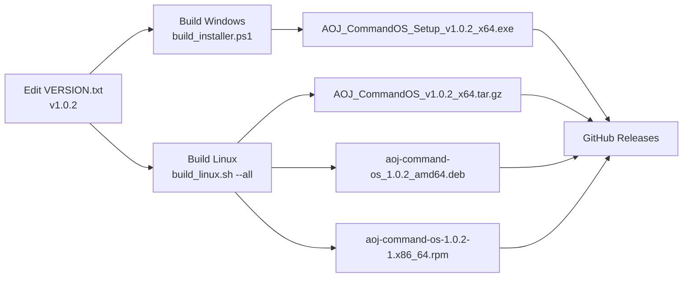

# AOJ Command OS — Cross-Platform Installation System

## 📋 Overview

Professional multi-platform installation and deployment system for **AOJ Command OS** (Airsoft Online Japan Tactical Server & Frontend), supporting Windows and Linux with feature parity.

### What's New (v1.0.1)

✅ **Windows Inno Setup Installer**
- Professional .exe with desktop icon, versioning, automatic upgrades
- Fully branded with Airsoft Online Japan tactical logo

✅ **Linux Multi-Format Support** *(NEW)*
- Portable tar.gz for universal deployment
- .deb packages for Ubuntu/Debian
- .rpm packages for Red Hat/CentOS/Fedora
- Systemd service for optional auto-startup
- Desktop integration (icons, .desktop files)

✅ **Cross-Platform Features**
- Single VERSION.txt source of truth
- Automatic version management in all outputs
- Branding/icon integration on both platforms
- Automatic upgrades with version detection
- Professional documentation for both platforms

---

## 🏗️ Architecture

```
installer/
├── build_installer.ps1            # Windows builder (PowerShell)
├── build_linux.sh                 # Linux builder (Bash)
├── aoj_installer.iss              # Inno Setup script (Windows)
├── assets/
│   ├── aoj_icon.ico               # Windows icon (provided)
│   ├── aoj_icon.png               # Linux icon (to be provided)
│   ├── aoj_logo.bmp               # Windows wizard image (optional)
│   └── aoj_launcher.sh            # Linux application launcher
├── after_install.txt              # Windows post-install info
├── verify_installers.sh           # Configuration verification tool
├── README.md                       # Cross-platform overview
├── INSTALLER_SETUP.md             # Windows detailed guide
├── LINUX_INSTALLER_SETUP.md       # Linux detailed guide
└── CROSS_PLATFORM_INSTALLER.md    # This file

PROJECT_ROOT/
├── VERSION.txt                    # Single version source
└── dist/installer/                # Build outputs
    ├── AOJ_CommandOS_Setup_v1.0.1_x64.exe
    ├── AOJ_CommandOS_v1.0.1_x64.tar.gz
    ├── aoj-command-os_1.0.1_amd64.deb
    └── aoj-command-os-1.0.1-1.x86_64.rpm
```

---

## 🎯 Feature Comparison Matrix

| Feature | Windows .exe | Linux tar.gz | Linux .deb | Linux .rpm |
|---------|:---:|:---:|:---:|:---:|
| **Installation** | GUI wizard | Manual extract | Single command | Single command |
| **Desktop icon** | ✅ Automatic | ⚠️ Manual | ✅ Menu | ✅ Menu |
| **Auto-startup** | ✅ Checkbox | ⚠️ Manual | ✅ Systemd | ✅ Systemd |
| **Auto-upgrade** | ✅ GUID-based | ⚠️ Manual | ✅ dpkg | ✅ rpm |
| **Branding** | ✅ Full | ✅ Full | ✅ Full | ✅ Full |
| **Version control** | ✅ Visible | ✅ Visible | ✅ Visible | ✅ Visible |
| **User isolation** | ❌ Current | ⚠️ Optional | ✅ aoj-os | ✅ aoj-os |
| **Data persistence** | ✅ Program Files | ✅ install dir | ✅ /opt | ✅ /opt |
| **System integration** | ✅ Full | ⚠️ Manual | ✅ Full | ✅ Full |
| **Portability** | Windows only | Universal Linux | Ubuntu/Debian | RHEL/CentOS |
| **Build requirement** | Windows + Inno Setup | Any bash | Add: fpm | Add: fpm |

---

## 🚀 Build & Distribution Workflow

### Development Build Cycle



### Version Bumping Process

1. **Update source version:**
   ```bash
   echo "1.0.2" > VERSION.txt
   ```

2. **Build all formats:**
   ```bash
   # Windows (from Windows machine or WSL)
   powershell -ExecutionPolicy Bypass -File installer\build_installer.ps1
   
   # Linux
   bash installer/build_linux.sh --all
   ```

3. **Verify outputs:**
   ```
   dist/installer/
   ├── AOJ_CommandOS_Setup_v1.0.2_x64.exe (4.2 MB)
   ├── AOJ_CommandOS_v1.0.2_x64.tar.gz (125 MB)
   ├── aoj-command-os_1.0.2_amd64.deb (125 MB)
   └── aoj-command-os-1.0.2-1.x86_64.rpm (130 MB)
   ```

4. **Release to GitHub:**
   - Create tag: `git tag -a v1.0.2`
   - Attach all 4 files
   - Publish release notes

---

## 📦 Installation Command Reference

### Windows (End Users)

```powershell
# Download and run
.\AOJ_CommandOS_Setup_v1.0.1_x64.exe
# → GUI wizard handles everything
```

### Linux (End Users)

**Ubuntu/Debian:**
```bash
wget https://releases.example.com/aoj-command-os_1.0.1_amd64.deb
sudo dpkg -i aoj-command-os_1.0.1_amd64.deb
sudo /opt/aoj-command-os/scripts/install_linux.sh  # First time
/opt/aoj-command-os/assets/aoj_launcher.sh         # Launch
```

**Red Hat/CentOS/Fedora:**
```bash
wget https://releases.example.com/aoj-command-os-1.0.1-1.x86_64.rpm
sudo rpm -i aoj-command-os-1.0.1-1.x86_64.rpm
sudo /opt/aoj-command-os/scripts/install_linux.sh  # First time
/opt/aoj-command-os/assets/aoj_launcher.sh         # Launch
```

**Portable (Any Linux/macOS):**
```bash
wget https://releases.example.com/AOJ_CommandOS_v1.0.1_x64.tar.gz
mkdir -p ~/aoj
tar xzf AOJ_CommandOS_v1.0.1_x64.tar.gz -C ~/aoj --strip-components=1
cd ~/aoj
bash scripts/install_linux.sh
bash assets/aoj_launcher.sh
```

---

## 🔧 Build System Details

### Windows Builder (build_installer.ps1)

```powershell
# Quick build with default settings
powershell -ExecutionPolicy Bypass -File installer\build_installer.ps1

# Build with code signing (requires cert)
powershell -ExecutionPolicy Bypass -File installer\build_installer.ps1 -Sign

# Output: dist/installer/AOJ_CommandOS_Setup_v1.0.1_x64.exe
```

**Features:**
- Reads VERSION.txt automatically
- Detects Inno Setup compiler (6.x)
- Asset verification (icon, logo files)
- Old build cleanup
- Console output with version display

**Environment (optional):**
```powershell
$env:AOJ_SIGN_CERT_PATH = "C:\path\to\cert.pfx"
$env:AOJ_SIGN_CERT_PASSWORD = "password"
$env:AOJ_SIGN_TIMESTAMP_URL = "http://timestamp.digicert.com"
```

### Linux Builder (build_linux.sh)

```bash
# Default: tar.gz only
bash installer/build_linux.sh

# All formats (requires fpm for .deb/.rpm)
bash installer/build_linux.sh --all

# Individual formats
bash installer/build_linux.sh --tar
bash installer/build_linux.sh --deb
bash installer/build_linux.sh --rpm

# Outputs:
# dist/installer/AOJ_CommandOS_v1.0.1_x64.tar.gz
# dist/installer/aoj-command-os_1.0.1_amd64.deb
# dist/installer/aoj-command-os-1.0.1-1.x86_64.rpm
```

**Features:**
- Reads VERSION.txt automatically
- Creates staging directory structure
- .desktop file generation
- Systemd service file
- Debian pre/post install scripts
- Asset verification
- Multi-format support

**Dependencies for .deb/.rpm:**
```bash
gem install fpm
# OR: sudo apt-get install ruby ruby-dev && gem install fpm
# OR: sudo dnf install ruby ruby-dev && gem install fpm
```

---

## 🎨 Asset Management

### Icon Requirements

**Windows (aoj_icon.ico):**
- Format: .ico with multiple resolutions
- Sizes: 16×16, 32×32, 64×64, 128×128, 256×256
- Location: `installer/assets/aoj_icon.ico`
- Usage: Taskbar, shortcuts, wizard, uninstaller

**Linux (aoj_icon.png):**
- Format: PNG with transparency
- Size: 256×256px (scaled as needed)
- Location: `installer/assets/aoj_icon.png`
- Usage: Menu, desktop, system icons

### Logo Image (Optional)

**Windows Wizard (aoj_logo.bmp):**
- Format: BMP 24-bit
- Size: 480×360px
- Location: `installer/assets/aoj_logo.bmp`
- Usage: Installer wizard pages

---

## ✅ Verification Checklist

Before building installers, run:

```bash
bash installer/verify_installers.sh
```

This checks:
- ✓ VERSION.txt exists and readable
- ✓ Windows installer files present
- ✓ Linux installer files present and executable
- ✓ Documentation complete
- ✓ Build tools available
- ✓ Asset files found (if provided)

---

## 📖 Documentation Map

| Document | Purpose | Audience |
|----------|---------|----------|
| [README.md](README.md) | Quick start & overview | Everyone |
| [INSTALLER_SETUP.md](INSTALLER_SETUP.md) | Windows detailed guide | Windows users/admins |
| [LINUX_INSTALLER_SETUP.md](LINUX_INSTALLER_SETUP.md) | Linux detailed guide | Linux users/admins |
| [assets/README.md](assets/README.md) | Asset preparation | Developers |
| [CROSS_PLATFORM_INSTALLER.md](CROSS_PLATFORM_INSTALLER.md) | This file - architecture | Developers/Admins |

---

## 🔄 Upgrade & Migration Guide

### In-Place Upgrade (Same Platform)

**Windows:**
1. Install new .exe over existing version
2. GUID detection triggers upgrade workflow
3. Previous version automatically replaced
4. Settings and data preserved

**Linux (deb):**
```bash
sudo dpkg -i aoj-command-os_1.0.2_amd64.deb
# Automatic upgrade, data preserved
```

**Linux (rpm):**
```bash
sudo rpm -U aoj-command-os-1.0.2-1.x86_64.rpm
# Automatic upgrade, data preserved
```

### Cross-Platform Migration

**Windows → Linux:**
```bash
# 1. Export from Windows
# Backup: %ProgramFiles%\AOJ Command OS\backend\data\
# 2. Transfer to Linux
# 3. Install Linux version, place data in /opt/aoj-command-os/backend/data/
```

**Linux → Windows:**
```bash
# 1. Export from Linux
# Backup: /opt/aoj-command-os/backend/data/
# 2. Transfer to Windows
# 3. Install Windows version, place data in Program Files\AOJ Command OS\backend\data\
```

---

## 🐛 Troubleshooting

### Build Issues

| Issue | Windows | Linux |
|-------|---------|-------|
| Inno Setup not found | Install from https://jrsoftware.org/isdl.php | N/A |
| VERSION.txt not found | Ensure at project root | Same |
| Asset files missing | Build proceeds (optional), reduced UI | Same |
| Build outputs not in dist/ | Check `dist/installer/` directory created | Same |

### Installation Issues

| Issue | Windows | Linux |
|-------|---------|-------|
| Python not found | Auto-installedif missing (apt.get) | Run `sudo apt-get install python3.11` |
| Port already in use | Kill existing process or use different port | Same |
| Permission denied | Run as Administrator | Use `sudo` or check ownership |
| Desktop icon missing | Check Tasks settings in .iss | Check .desktop file in `/usr/share/applications/ `|

---

## 📊 Release Checklist

Before releasing a new version:

- [ ] Update VERSION.txt
- [ ] Update after_install.txt (Windows)
- [ ] Review and update CHANGELOG
- [ ] Build and test all formats:
  - [ ] Run on Windows: `powershell -ExecutionPolicy Bypass -File installer\build_installer.ps1`
  - [ ] Run on Linux: `bash installer/build_linux.sh --all`
  - [ ] Verify outputs in dist/installer/
- [ ] Test each installer on target OS:
  - [ ] Windows .exe installation and launch
  - [ ] Ubuntu/Debian .deb installation and launch
  - [ ] CentOS/Fedora .rpm installation and launch
  - [ ] Portable tar.gz extraction and launch
- [ ] Test upgrade path (install old version, then upgrade)
- [ ] Create GitHub release with all 4 files
- [ ] Post release notes and installation links

---

## 🎯 Next Steps

1. **Provide PNG Icon** (256×256px) for Linux:
   - Place at `installer/assets/aoj_icon.png`
   - Enables system menu icons on Linux systems

2. **Provide PNG Icon** (256×256px or larger) - if not already provided:
   - Can be same image as Linux icon, resized
   - Or higher quality version for Windows taskbar

3. **First Release Build**:
   ```bash
   # On Windows
   powershell -ExecutionPolicy Bypass -File installer\build_installer.ps1
   
   # On Linux
   bash installer/build_linux.sh --all
   ```

4. **Test All Formats**:
   - Install .exe on Windows
   - Install .deb on Ubuntu/Debian
   - Install .rpm on CentOS/Fedora
   - Extract .tar.gz on any Linux/macOS

5. **Release to GitHub**:
   - Tag: `git tag -a v1.0.1 -m "Release v1.0.1"`
   - Create release: https://github.com/bravo-nineteen/AOJ-Server/releases/new
   - Attach all 4 installers
   - Include installation instructions from README.md

---

## 📞 Support

- **Issues**: https://github.com/bravo-nineteen/AOJ-Server/issues
- **Releases**: https://github.com/bravo-nineteen/AOJ-Server/releases
- **Docs**: https://github.com/bravo-nineteen/AOJ-Server/blob/main/README.md

---

**Status**: ✅ Ready to build | **Version**: 1.0.1 | **Updated**: 2026-05-11
